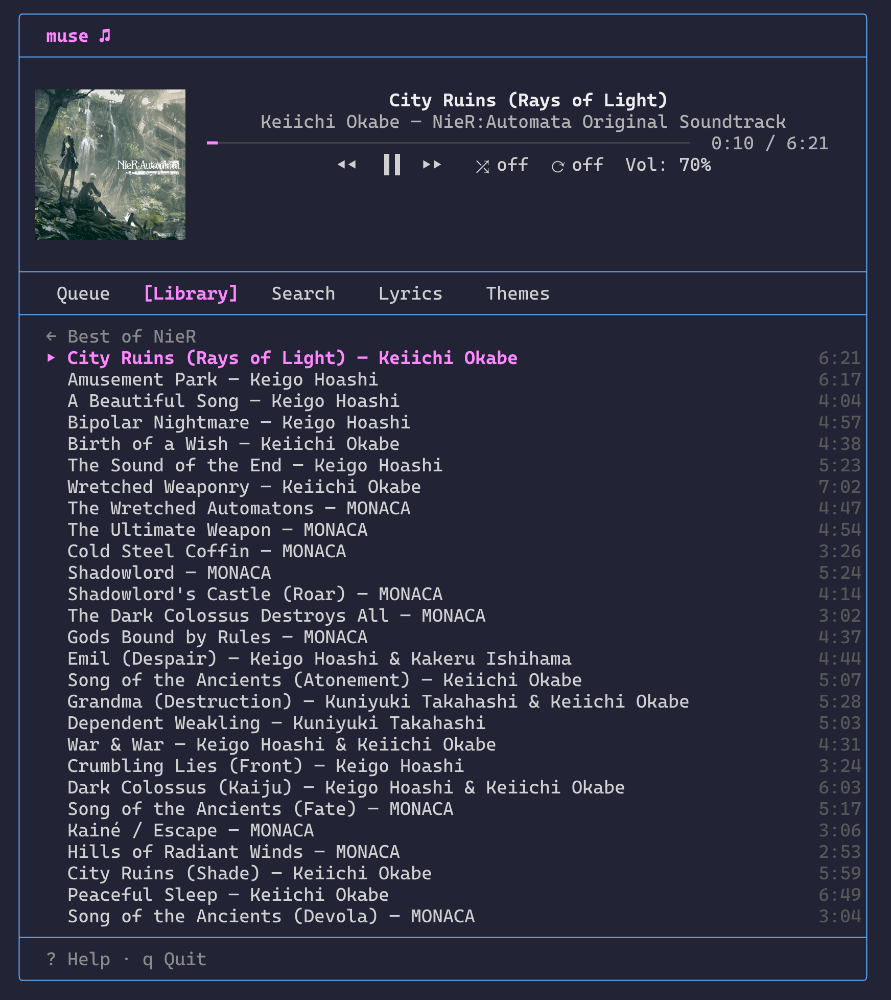

# muse

A terminal UI for controlling Apple Music on macOS.



## Features

- Full playback control (play/pause, next/previous, volume, shuffle, repeat)
- Browse playlists and search your library
- Favorite tracks and add them to playlists
- Jump to the current track's artist or album with a single key
- Open the artist page or full album directly in Music.app
- Queue management with auto-advance
- Lyrics display fetched from LRCLIB (with embedded lyrics fallback)
- Album art display via sixel graphics in supported terminals
- Customizable color themes

## Requirements

- macOS 13+
- Swift 6.2+
- Apple Music app (must be running)

## Install

```
git clone <repo-url>
cd muse
just
```

Or build and install manually:

```
swift build -c release
cp .build/release/muse ~/.local/bin/
```

## Usage

Launch `muse` in any terminal. The player panel at the top always shows the current track. Use the tabbed panel below to browse your library, manage the queue, or search.

### Key Bindings

| Key | Action |
|-----|--------|
| `Tab` / `Shift+Tab` | Cycle tabs |
| `l` | Library tab |
| `/` | Search tab |
| `L` | Lyrics tab |
| `space` | Play / Pause |
| `n` | Next track |
| `p` | Previous track |
| `+` / `=` | Volume up |
| `-` | Volume down |
| `s` | Toggle shuffle |
| `r` | Cycle repeat (off → all → one) |
| `C` | Clear queue |
| `f` | Toggle favorite |
| `P` | Add to playlist |
| `a` | Search current track's artist |
| `A` | Search current track's album |
| `o` | Open artist in Music.app |
| `O` | Open album in Music.app |
| `↑` / `↓` | Navigate list / Scroll lyrics |
| `Enter` | Play track / Browse playlist |
| `Backspace` | Back (library) / Clear (search) |
| `?` | Toggle help overlay |
| `q` | Quit |

### Tabs

- **Queue** — tracks from the last playlist you played. Select a track and press Enter to jump to it. Tracks auto-advance when the current one finishes.
- **Library** — browse your playlists. Press Enter to see tracks, Enter again to play. Backspace goes back to the playlist list.
- **Search** — type to search your library. Results appear as you type (minimum 2 characters). Enter plays the selected result.
- **Lyrics** — displays lyrics for the current track. Fetched from [LRCLIB](https://lrclib.net) (falls back to embedded lyrics if available). Scroll with arrow keys. Shows "No lyrics available" when none are found.
- **Themes** — select a color theme. Press Enter to apply.

Playback controls (`space`, `n`, `p`, `+`/`-`, `s`, `r`) work from any tab. In the Search tab, letter keys are captured for typing, so `n`/`p`/`s`/`r`/`a` only work as playback controls from the other tabs.

### Album Art

Album art is displayed automatically in terminals that support sixel graphics (WezTerm, iTerm2, foot, Ghostty, etc.). Detection uses the DA1 terminal query. To override:

```
MUSE_SIXEL=1 muse   # force enable
MUSE_SIXEL=0 muse   # force disable
```
